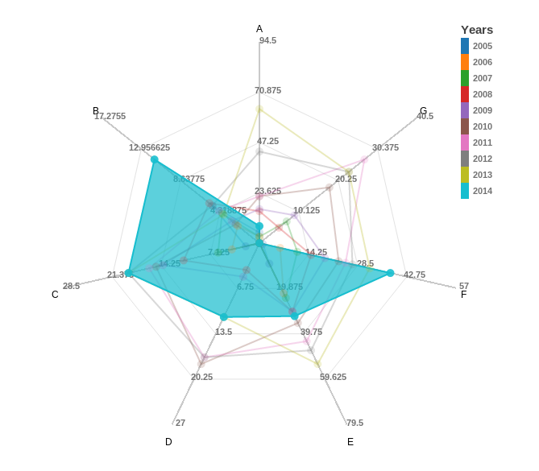

radar-chart-d3
==============

Simple radar chart in D3.js, with multiples ranges

Example
=======



```html
<html>
<head>
<style>
circle:hover {
    cursor: pointer;
}
.legend rect:hover {
    cursor: pointer;
}
</style>
</head>

<body>
<div id="text-chart">
	<div id="chart1"></div>
</div>
</body>
<html>
```

```javascript
var options = {
    w:500,
    h:500,
    factor:1,
    factorLegend:.8,
    levels: 4,
    maxValue: {},
    legend: [2005, 2006, 2007, 2008, 2009, 2010, 2011, 2012, 2013, 2014],
    legendText: 'Years',
    zoomOut: 1.5,
    ExtraWidthX: 200,
    ExtraWidthY: 200,
}

data = [[{"value": 5.0, "axis": "A"}, {"value": 5.1539999999999999, "axis": "B"}, {"value": 2.0, "axis": "C"}, {"value": 0.0, "axis": "D"}, {"value": 9.0, "axis": "E"}, {"value": 1.0, "axis": "F"}, {"value": 0.0, "axis": "G"}], [{"value": 3.0, "axis": "A"}, {"value": 2.3799999999999999, "axis": "B"}, {"value": 4.0, "axis": "C"}, {"value": 0.0, "axis": "D"}, {"value": 22.0, "axis": "E"}, {"value": 6.0, "axis": "F"}, {"value": 0.0, "axis": "G"}], [{"value": 3.0, "axis": "A"}, {"value": 4.0970000000000004, "axis": "B"}, {"value": 6.0, "axis": "C"}, {"value": 0.0, "axis": "D"}, {"value": 24.0, "axis": "E"}, {"value": 11.0, "axis": "F"}, {"value": 7.0, "axis": "G"}], [{"value": 15.0, "axis": "A"}, {"value": 5.5090000000000003, "axis": "B"}, {"value": 11.0, "axis": "C"}, {"value": 4.0, "axis": "D"}, {"value": 30.0, "axis": "E"}, {"value": 15.0, "axis": "F"}, {"value": 5.0, "axis": "G"}], [{"value": 16.0, "axis": "A"}, {"value": 3.0430000000000001, "axis": "B"}, {"value": 14.0, "axis": "C"}, {"value": 5.0, "axis": "D"}, {"value": 30.0, "axis": "E"}, {"value": 19.0, "axis": "F"}, {"value": 9.0, "axis": "G"}], [{"value": 22.0, "axis": "A"}, {"value": 2.6040000000000001, "axis": "B"}, {"value": 15.0, "axis": "C"}, {"value": 18.0, "axis": "D"}, {"value": 35.0, "axis": "E"}, {"value": 23.0, "axis": "F"}, {"value": 18.0, "axis": "G"}], [{"value": 22.0, "axis": "A"}, {"value": 4.4340000000000002, "axis": "B"}, {"value": 16.0, "axis": "C"}, {"value": 17.0, "axis": "D"}, {"value": 43.0, "axis": "E"}, {"value": 25.0, "axis": "F"}, {"value": 27.0, "axis": "G"}], [{"value": 43.0, "axis": "A"}, {"value": 5.1609999999999996, "axis": "B"}, {"value": 19.0, "axis": "C"}, {"value": 17.0, "axis": "D"}, {"value": 47.0, "axis": "E"}, {"value": 27.0, "axis": "F"}, {"value": 23.0, "axis": "G"}], [{"value": 63.0, "axis": "A"}, {"value": 3.9350000000000001, "axis": "B"}, {"value": 19.0, "axis": "C"}, {"value": 11.0, "axis": "D"}, {"value": 53.0, "axis": "E"}, {"value": 32.0, "axis": "F"}, {"value": 23.0, "axis": "G"}], [{"value": 8.0, "axis": "A"}, {"value": 11.516999999999999, "axis": "B"}, {"value": 19.0, "axis": "C"}, {"value": 11.0, "axis": "D"}, {"value": 32.0, "axis": "E"}, {"value": 38.0, "axis": "F"}, {"value": 0.0, "axis": "G"}]]

RadarChart.draw("#chart1", data, options);
```
